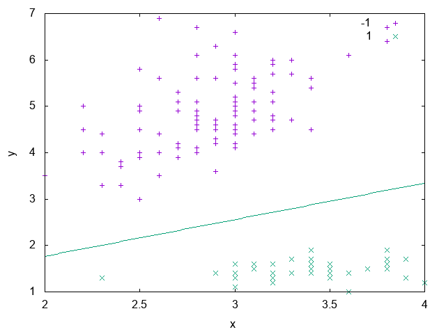
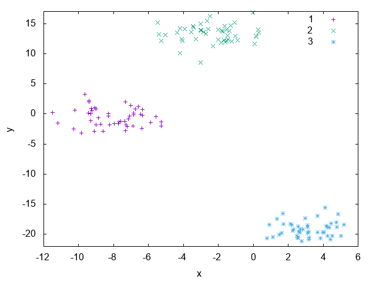

=============
Classification
=============

Often we are given the task, from ourselves or from others, to label things according to a set of already existing classes:

 * Is the object in the image a vehicle or a cat? 
 * Is this animal a dog or a cat? 

*Classification* is the problem of giving the right label to a record given as input. The task is different from regression because 
here we have discrete labels instead of continuous values [SKIENA2017]_. In this chapter we'll give a brief introduction on binary
and multi-class classification tasks and show how to tackle these problems using **UFJF-MLTK**.

Add ``#include <ufjfmltk/Classification.hpp>`` to include the classification module.

Binary classification
--------------------
Let :math:`Z = (x_{i}, y_{i})` be a set of samples of size :math:`m`, where :math:`x_{i} \in R^{d}`, called input space of the problem,
:math:`y_{i}` is a scalar representing the class of each vector :math:`x_{i}` and for binary classification :math:`y_{i} \in \{+1,-1\}`,
for :math:`i = \{1, \dots, m\}`. A linear classifier, in a linearly separable input space, is represented by a hyperplane with the following equation [VILLELA2011]_:

:math:`h(x) = \langle w, x \rangle + b`

The classification result can be obtained through a signal function :math:`\psi` applied to the discriminant value associated to the hyperplane equation, i.e:

:math:`\psi (h(x)) = +1` if :math:`h(x) \geq 0` 

or 

:math:`\psi (h(x)) = -1` if :math:`h(x) < 0`

.. figure:: images/classification/binclass.png
  :width: 450
  :align: center
  :alt: Example of a binary classification problem with a linear discriminant.

  Example of a binary classification problem with a linear discriminant.

The Perceptron algorithm
^^^^^^^^^^^^^^^^^^^^^^^^^

.. code-block:: cpp

    #include <ufjfmltk/ufjfmltk.hpp>

    namespace vis = mltk::visualize;
    namespace classifier = mltk::classifier;

    int main() {
        mltk::Data<double> data("iris.data");
        vis::Visualization<> vis(data);
        classifier::PerceptronPrimal<double> perceptron(data);

        ima.train();

        vis.plot2DwithHyperplane(1, 2, perceptron.getSolution(), true);

        return 0;
    }

  Solution generated from the model trained by the Perceptron classifier.

Kernel methods
--------------

.. figure:: images/classification/spirals.png
  :width: 450
  :align: center
  :alt: Spirals artificial dataset.

  Spirals artificial dataset.

The Perceptron dual algorithm 
^^^^^^^^^^^^^^^^^^^^^^^^^^^^^

.. code-block:: cpp

    #include <ufjfmltk/ufjfmltk.hpp>

    namespace vis = mltk::visualize;
    namespace classifier = mltk::classifier;

    int main() {
        auto data = mltk::datasets::make_spirals(500);
        vis::Visualization<> vis(data);
        classifier::PerceptronDual<double> perceptron(data, mltk::KernelType::GAUSSIAN, 0.5);

        perceptron.train();

        vis.plotDecisionSurface2D(perceptron, 0, 1, true);
        return 0;
    }

.. figure:: images/classification/contour-spirals-percdual.png
  :width: 450
  :align: center
  :alt: Decision contour surface from Perceptron dual for spirals dataset.

  Decision contour surface from Perceptron dual for spirals dataset.

Multi-class classification
-------------------------

  Blobs artificial dataset.

The One-vs-One algorithm
^^^^^^^^^^^^^^^^^^^^^^^^

.. code-block:: cpp

    #include <ufjfmltk/ufjfmltk.hpp>

    namespace vis = mltk::visualize;
    namespace classifier = mltk::classifier;

    int main() {
        auto data = mltk::datasets::make_blobs(50, 3, 2, 1.5, -20, 20, true, true, 10).dataset;
        vis::Visualization<> vis(data);
        classifier::PerceptronPrimal<double> perceptron;
        classifier::OneVsOne<double> ovo(data, perceptron);

        ovo.train();

        vis.plotDecisionSurface2D(ovo, 0, 1, true, 100, true);

        return 0;
    }

.. figure:: images/classification/contour-blobs-ovo.png
  :width: 450
  :align: center
  :alt: Decision contour surface from OVO with perceptron for blobs dataset.

  Decision contour surface from OVO with perceptron for blobs dataset.

The One-vs-All algorithm
^^^^^^^^^^^^^^^^^^^^^^^^

.. code-block:: cpp

    #include <ufjfmltk/ufjfmltk.hpp>

    namespace vis = mltk::visualize;
    namespace classifier = mltk::classifier;

    int main() {
        auto data = mltk::datasets::make_blobs(50, 3, 2, 1.5, -20, 20, true, true, 10).dataset;
        vis::Visualization<> vis(data);
        classifier::PerceptronPrimal<double> perceptron;
        classifier::OneVsAll<double> ova(data, perceptron);

        ova.train();

        vis.plotDecisionSurface2D(ova, 0, 1, true, 100, true);
        return 0;
    }

.. figure:: images/classification/contour-blobs-ova.png
    :width: 450
    :align: center
    :alt: Decision contour surface from OVA with perceptron for blobs dataset.

    Decision contour surface from OVA with perceptron for blobs dataset.

Evaluating a classifier performance
-----------------------------------

.. [SKIENA2017] Skiena, Steven S. The data science design manual. Springer, 2017.
.. [VILLELA2011] Villela, Saulo Moraes, et al. "Seleção de Características utilizando Busca Ordenada e um Classificador de Larga Margem." (2011).
