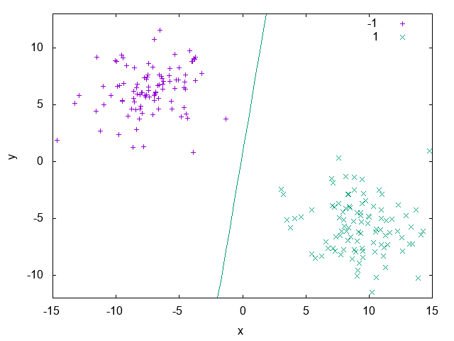
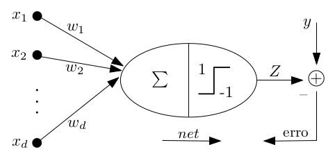

==============
Classification
==============

Often we are given the task, from ourselves or from others, to label things according to a set of already existing classes:

 * Is the object in the image a vehicle or a cat? 
 * Is this animal a dog or a cat? 

*Classification* is the problem of giving the right label to a record given as input. The task is different from regression because 
here we have discrete labels instead of continuous values [SKIENA2017]_. In this chapter we'll give a brief introduction on binary
and multi-class classification tasks and show how to tackle these problems using **UFJF-MLTK**.

Add ``#include <ufjfmltk/Classification.hpp>`` to include the classification module.

Binary classification
---------------------

  Example of a binary classification problem with a linear discriminant.

Let :math:`Z = (x_{i}, y_{i})` be a set of samples of size :math:`m`, where :math:`x_{i} \in R^{d}`, called input space of the problem,
:math:`y_{i}` is a scalar representing the class of each vector :math:`x_{i}` and for binary classification :math:`y_{i} \in \{+1,-1\}`,
for :math:`i = \{1, \dots, m\}`. A linear classifier, in a linearly separable input space, is represented by a hyperplane with the following equation [VILLELA2011]_:

.. math::
  
  h(x) = \langle w, x \rangle + b

The classification result can be obtained through a signal function :math:`\varphi` applied to the discriminant value associated to the hyperplane equation, i.e:

.. math::

  \varphi (h(x)) = 
  \begin{cases}
    +1,& \text{if } h(x) \geq 0\\
    -1,& \text{otherwise}
  \end{cases}

The Perceptron algorithm
^^^^^^^^^^^^^^^^^^^^^^^^

Considered the first learning algorithm, the Perceptron model is a pattern recognition model proposed by [ROSENBLATT1958]_. It's structured by
a input layer connecting each input unit to a component from a :math:`d`-dimension vector, and a output layer composed of :math:`m` units.
Therefore, it's an artificial neural network model with only one processing layer. In its simplest form, the Perceptron algorithm is a classification
algorithm involving only two classes [VILLELA2011]_.

  Perceptron model topology.

The algorithm developed by Rosenblatt can be utilized to determine the :math:`w` vector in a limited number of iterations, where the number of 
iterations is related to the number of updates of the weights vector. As the weights vector :math:`w` is determined by successive corrections in order
to minimize a loss function, we can say that the separating hyperplane is constructed in a iterative way characterizing an *online* learning process [VILLELA2011]_.   

.. code-block:: cpp
    :emphasize-lines: 9,11
    :caption: Primal Perceptron example
    :name: primal-perc

    #include <ufjfmltk/ufjfmltk.hpp>

    namespace vis = mltk::visualize;
    namespace classifier = mltk::classifier;

    int main() {
        mltk::Data<double> data("iris.data");
        vis::Visualization<> vis(data);
        classifier::PerceptronPrimal<double> perceptron(data);

        perceptron.train();

        vis.plot2DwithHyperplane(1, 2, perceptron.getSolution(), true);

        return 0;
    }

On :numref:`primal-perc` we can see a simple usage of the **UFJF-MLTK** perceptron implementation in it's primal form. In this example we first
load the binary ``iris.data`` dataset where two of the three original classes were merged into one in order to generate a binary problem, after that we instantiate
the ``PerceptronPrimal`` wrapper with the same data type as the dataset and the default parameters. With the object from the algorithm wrapper we call the 
method ``train`` to learn a model from the data and, finally, the decision boundary is ploted with features 1 and 2 from the dataset and passing the perceptron solution. :numref:`primal-perc-hyp`
shows the hyperplane generated by the model.

.. figure:: images/classification/ima-iris-2dsol.png
  :width: 450
  :align: center
  :name: primal-perc-hyp
  :alt: Solution generated from the model trained by the Perceptron classifier.

  Solution generated from the model trained by the Perceptron classifier.

Kernel methods
--------------

Often in real datasets is not possible to do a linear separation of the data. In these cases is necessary
to utilize more complex functions for labels separation. One way to define a non-linear separator is through 
a mapping function from input space :math:`X` to a higher dimensional space where the separation is possible [MEHRYAR2012]_.

In models based on a mapping from the fixed non-linear features space :math:`\Phi(x)`, the kernel function is defined
as following [BISHOP2007]_:

.. math::
  :label: kernel-func

  k(x, x^{'}) = \Phi(x)^{T}\Phi(x^{'})

:numref:`spirals-data` shows an example of a dataset that isn't linearly separable. It's composed of two spirals and as we can see, there isn't a way to
draw a line that separates the samples belonging to each spiral. In the `Dual Perceptron <#the-perceptron-dual-algorithm>`_ section we'll see how to solve this problem. 

.. figure:: images/classification/spirals.png
  :width: 450
  :align: center
  :name: spirals-data
  :alt: Spirals artificial dataset.

  Spirals artificial dataset.

The simplest kernel considering the mapping on Equation :math:numref:`kernel-func` is the linear kernel where 
:math:`\Phi(x) = x` and :math:`k(x, x^{'}) = x^{T}x`. The kernel concept formulated as a inner product in the 
input space allows the generalization of many known algorithms. The main idea is that if an algorithm is formulated
in such a way that the input vector :math:`x` is presented in a scalar product form, the inner product can be replaced
by another kernel product. This kind of extension is known as **kernel trick** or kernel substitution [BISHOP2007]_.

The Perceptron dual algorithm 
^^^^^^^^^^^^^^^^^^^^^^^^^^^^^

The derivation and implementation of the dual form of the Perceptron algorithm will be shown in Section ??, since it's a more complex topic. For now,
we'll use **UFJF-MLTK** implementation to solve the spirals dataset problem presented earlier. 

.. code-block:: cpp
  :name: dualperc-spirals
  :emphasize-lines: 9,11,12
  :caption: Dual perceptron training on spirals artificial dataset.

    #include <ufjfmltk/ufjfmltk.hpp>

    namespace vis = mltk::visualize;
    namespace classifier = mltk::classifier;

    int main() {
        auto data = mltk::datasets::make_spirals(500);
        vis::Visualization<> vis(data);
        classifier::PerceptronDual<double> perceptron(data, mltk::KernelType::GAUSSIAN, 1);

        perceptron.setMaxTime(500);
        perceptron.train();

        vis.plotDecisionSurface2D(perceptron, 0, 1, true, 100);
        return 0;
    }

:numref:`dualperc-spirals` example generates a spirals 
dataset with 500 samples using the ``make_spirals`` function from ``mltk::datasets::`` namespace, initialize the visualization object and instantiate the ``PerceptronDual``
wrapper with a gaussian kernel with standard deviation of 1.0 as a kernel parameter. To guarantee the algorithm convergence, the maximum training time of the algorithm
is set as 500ms, after that, the model is trained and its decision boundary is ploted as in :numref:`spirals-dualperc-dec`.

.. figure:: images/classification/contour-spirals-percdual.png
  :width: 450
  :align: center
  :name: spirals-dualperc-dec
  :alt: Decision contour surface from Perceptron dual for spirals dataset.

  Decision contour surface from Perceptron dual for spirals dataset.

Multi-class classification
--------------------------

.. figure:: images/classification/blobs.png
  :width: 450
  :align: center
  :alt: Blobs artificial dataset.

  Blobs artificial dataset.

The One-vs-One algorithm
^^^^^^^^^^^^^^^^^^^^^^^^

.. code-block:: cpp

    #include <ufjfmltk/ufjfmltk.hpp>

    namespace vis = mltk::visualize;
    namespace classifier = mltk::classifier;

    int main() {
        auto data = mltk::datasets::make_blobs(50, 3, 2, 1.5, -20, 20, true, true, 10).dataset;
        vis::Visualization<> vis(data);
        classifier::PerceptronPrimal<double> perceptron;
        classifier::OneVsOne<double> ovo(data, perceptron);

        ovo.train();

        vis.plotDecisionSurface2D(ovo, 0, 1, true, 100, true);

        return 0;
    }

.. figure:: images/classification/contour-blobs-ovo.png
  :width: 450
  :align: center
  :alt: Decision contour surface from OVO with perceptron for blobs dataset.

  Decision contour surface from OVO with perceptron for blobs dataset.

The One-vs-All algorithm
^^^^^^^^^^^^^^^^^^^^^^^^

.. code-block:: cpp

    #include <ufjfmltk/ufjfmltk.hpp>

    namespace vis = mltk::visualize;
    namespace classifier = mltk::classifier;

    int main() {
        auto data = mltk::datasets::make_blobs(50, 3, 2, 1.5, -20, 20, true, true, 10).dataset;
        vis::Visualization<> vis(data);
        classifier::PerceptronPrimal<double> perceptron;
        classifier::OneVsAll<double> ova(data, perceptron);

        ova.train();

        vis.plotDecisionSurface2D(ova, 0, 1, true, 100, true);
        return 0;
    }

.. figure:: images/classification/contour-blobs-ova.png
    :width: 450
    :align: center
    :alt: Decision contour surface from OVA with perceptron for blobs dataset.

    Decision contour surface from OVA with perceptron for blobs dataset.

Evaluating a classifier performance
-----------------------------------

.. [SKIENA2017] Skiena, Steven S. The data science design manual. Springer, 2017.
.. [VILLELA2011] Villela, Saulo Moraes, et al. "Seleção de Características utilizando Busca Ordenada e um Classificador de Larga Margem." (2011).
.. [ROSENBLATT1958] Rosenblatt, Frank. "The perceptron: a probabilistic model for information storage and organization in the brain." Psychological review 65.6 (1958): 386.
.. [MEHRYAR2012] Mohri, Mehryar, Afshin Rostamizadeh, and Ameet Talwalkar. Foundations of machine learning. MIT press, 2018.
.. [BISHOP2007] Biship, Christopher M. "Pattern recognition and machine learning (information science and statistics)." (2007).