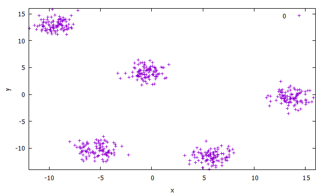

==========
Clustering
==========

**Clustering** is the process of grouping a set o data objects into several groups. Each group 
has points that are very similar to others in the same group, while at the same time they are 
very dissimilar to points in other groups. Similarities and dissimilarities are usually measured 
with a distance metric in clustering algorithms [HAN2011]_.

  Example of blobs dataset with 5 point clouds.

Partitioning methods
====================

Partitioning methods are based on the construction of :math:`k` partitions of the data from a set of :math:`n` objects,
where each partition represents a cluster and :math:`k \leq n`. Usually, partitioning methods adopt *exclusive cluster separation*, i.e.,
each object must belong to exactly one group. Most partitioning methods are distance-based [HAN2011]_. 

The :math:`k`-Means algorithm
^^^^^^^^^^^^^^^^^^^^^^^^^^^^^

The :math:`k`-means algorithm works by first assigning as centroids of the clusters :math:`k` random points from the dataset, representing the mean of the clusters. For each 
remaining objects, each of them is assigned to the cluster were it is most similar based on the euclidean distance and the cluster mean. Then, it iteratively improves the within-cluster
variation. At each iteration it computes the new clusters means using the objects assigned in the previous iteration and only stops when the assignment is stable, that is, the clusters
formed in the current round are the same as those formed in the previous round [HAN2011]_. :numref:`kmeans-blobs1` shows how to generate blobs artificial data for clustering algorithms, 
plots the dataset, instantiates the :math:`k`-means clustering algorithm wrapper and train it.

.. code-block:: cpp
  :name: kmeans-blobs1
  :caption: :math:`k`-means training on blobs dataset with :math:`k=5`

  #include <ufjfmltk/ufjfmltk.hpp>

  namespace visual = mltk::visualize;
  namespace cluster = mltk::clusterer;

  int main(){
      auto data = mltk::datasets::make_blobs(100, 5, 2, 1, -15, 15,
                                            true, false, 2).dataset;
      visual::Visualization<double> vis(data);

      vis.plot2D();

      cluster::KMeans<double> kmeans(data, 5, "kmeanspp", 2, 1);

      kmeans.train();
      mltk::Data result = kmeans.batchEvaluate(data);
      vis.setSample(result);
      vis.plot2D();
  }

After training the model, the data can be passed to the method ``batchEvaluate`` that returns 
a new dataset object with the points associated to the clusters. As we can see at :numref:`blobs-cluster`, the
:math:`k`-means algorithm was able to correctly separate similar data in well defined clusters. 

  Clustering result using :math:`k`-means with :math:`k=5`.

.. [HAN2011] Han, Jiawei, Jian Pei, and Micheline Kamber. Data mining: concepts and techniques. Elsevier, 2011.