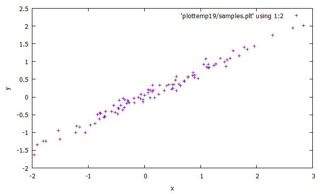
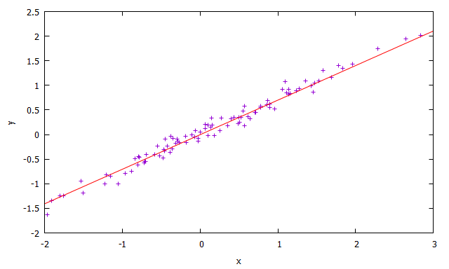

==========
Regression
==========

The **Regression** problem consists in predicting the real valued labels
of the points being considered [MEHRYAR2018]_. Here we're interested in regression as a tool for value forecasting. Each observed point :math:`p=(x,y)` is
the result of the functon :math:`y=\mathcal{f}(x)`, where :math:`x` are the feature variables and :math:`y` is the 
target variable. Given :math:`\mathcal{S} = {p_1, \dots, p_n}`, the objective of regression is to find 
:math:`\mathcal{f}(x)` that best explains the points on :math:`\mathcal{S}` [SKIENA2017]_. 

  Example of a regression dataset, where x is the regression feature and y is the desired value.

Linear regression
-----------------

Given a set of :math:`n` points, **linear regression** seeks to fit a line 
which best describes the points, as shown in :numref:`reg-ex`. There are several 
reasons to use linear regression models, some of them are simplification and comprehension.
As the regression shows the underlying trend in the data and highlights the location and magnitude
of outliers, it's a useful tool for visualization [SKIENA2017]_. 

  Example of a linear regression model fit on artificial data.

:numref:`reg-lst-example` generates an artificial regression problem with one dimension on the feature set and one target variable. After the data generation, 
the data is plotted as in :numref:`reg-data` and a wrapper for the **Least Mean Squares (LMS)** algorithm is instantiated with a learning rate of 0.05. The wrapper 
object is configured with a max training time of 200ms and is trained. Finally, the final hyperplane is plotted as :numref:`reg-ex`. 

.. code-block:: cpp
  :name: reg-lst-example
  :emphasize-lines: 4,6,9
  :caption: Regression example using the LMS algorithm.

  #include <ufjfmltk/ufjfmltk.hpp>

  int main(){
      auto data = mltk::datasets::make_regression(100, 1, 0, 0.1, 0.01, 10, true, 2).dataset;
      mltk::visualize::Visualization<double> vis(data);
      mltk::regressor::LMSPrimal<> lms(data, 0.05, 1);

      lms.setMaxTime(200);
      lms.train();

      vis.plot1DRegresion();
      vis.plot1DRegresionHyperplane(0, lms.getSolution());
  }

.. [MEHRYAR2018] Mohri, Mehryar, Afshin Rostamizadeh, and Ameet Talwalkar. Foundations of machine learning. MIT press, 2018.
.. [SKIENA2017] Skiena, Steven S. The data science design manual. Springer, 2017.